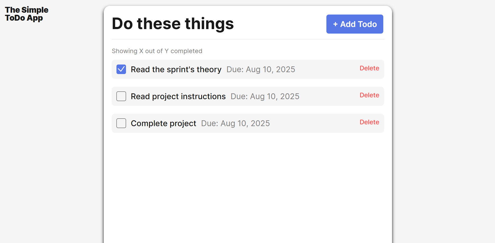

    # Simple Todo App

A clean and intuitive Todo application that allows users to add, track, and manage their daily tasks efficiently. Built with modular, object-oriented JavaScript, this app emphasizes usability and responsive design for a smooth user experience.

    ## Functionality

    - Add new todo items with task name and due date.

- Mark tasks as completed or uncompleted.

- Delete tasks from the list.

- Form validation with real-time feedback for input fields.

- Dynamic enabling/disabling of the submit button based on form validity.

- Reset validation and clear inputs after successful task submission.

- Responsive design for desktop and mobile devices.

## Technology

- Vanilla JavaScript with ES6 classes and modules for clean code structure.

- HTML5 and CSS3 with custom styling for a modern UI.

- Form validation implemented via an OOP FormValidator class for reusable and scalable validation logic.

- DOM manipulation for dynamic todo list rendering.

- No external libraries or frameworks used to keep it lightweight.

  ## Deployment

  This project is deployed on GitHub Pages:

  - https://github.com/lizmary0209/se_project_todo-app.git
